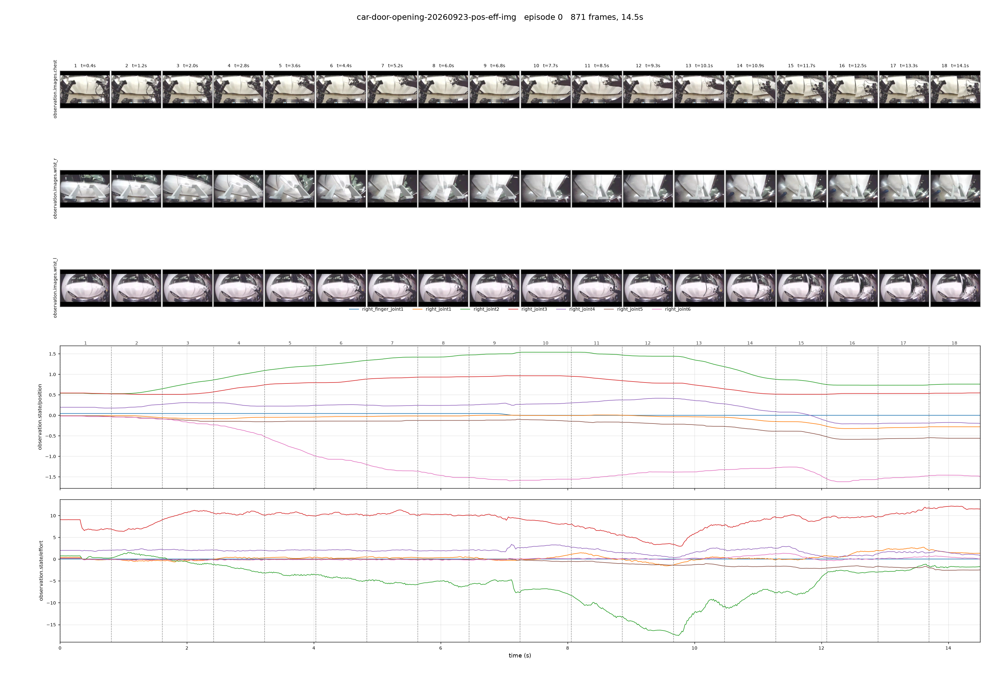
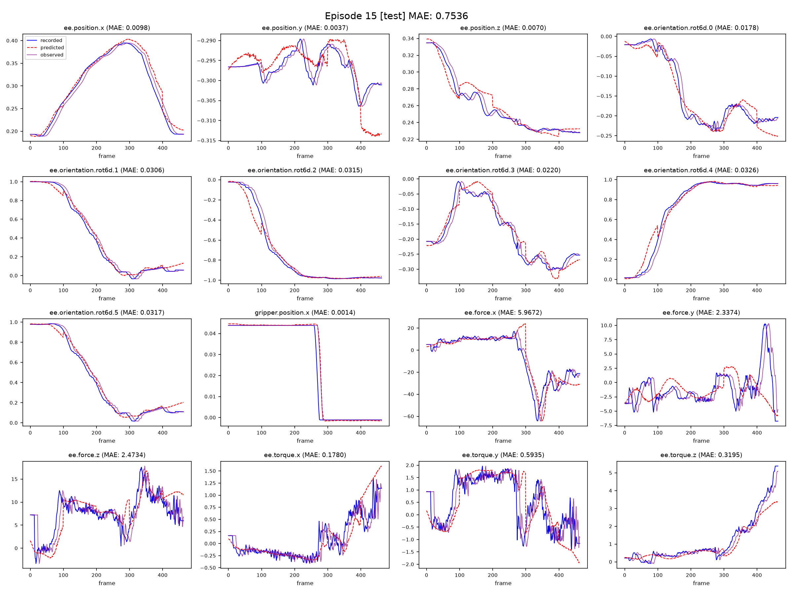
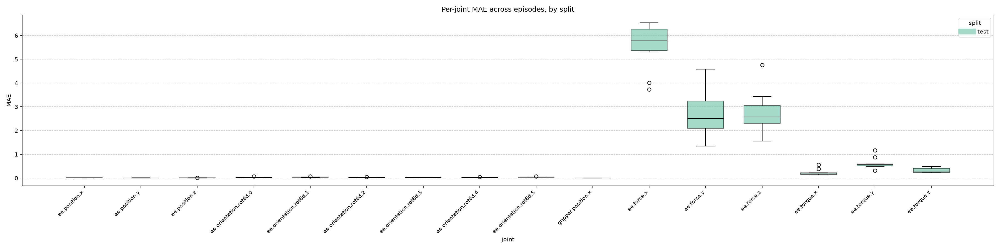
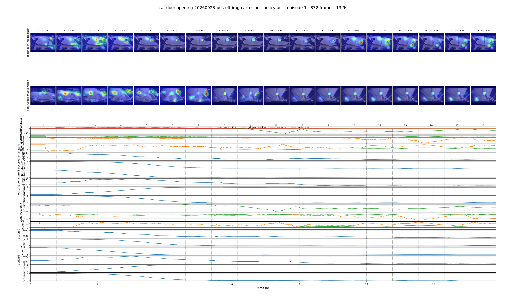

# Data Conversion

## Validate MCAP

## Convert MCAP to LeRobotDataset v3.0

## Edit LeRobotDataset

# Data Visualization

## Dataset plots

`lerobot-dataset-plot` saves one static overview image per episode: a strip of camera keyframes sampled evenly across the episode, above time-synced plots of the state and action signals. Requires the `dataset_viz` extra.

Flags:

- `--dataset-path`: local dataset folder containing `meta/info.json` (required).
- `--episodes`: episode indices to plot (default: all).
- `--feature-keys`: 1-D feature keys to plot (default: `observation.state action`).
- `--obs-plot-groups`: dimension groups to plot, one subplot each (default: `position velocity effort`). If none match the dataset, every group is plotted.
- `--image-observations`: RGB video camera keys for the keyframe strips (default: all RGB cameras).
- `--num-image-samples`: keyframes per camera per episode (default: 18, minimum 1).
- `--output-dir`: where to write `episode_<i>.png` (default: `<dataset-path>/episode_plots/`).
- `--dpi`: saved figure resolution (default: 130).
- `--tolerance-s`: timestamp tolerance for dataset loading and video decoding (default: 1e-4).

Example:

```bash
lerobot-dataset-plot \
  --dataset-path /path/to/<dataset_name>
```

<p align="center">
  
</p>

# Model Training

## Train locally

List every flag. The `--policy.*` flags are only listed once a policy type is given:

```bash
lerobot-train --help
lerobot-train --policy.type=act --help
```

Example:

```bash
lerobot-train \
  --dataset.root=/path/to/<dataset_name> \
  --policy.type=act \
  --job_name=act-<dataset_name> \
  --dataset.image_transforms.enable=true \
  --dataset.image_transforms.max_num_transforms=3 \
  --dataset.exclude_features='["observation.images.wrist_l"]' \
  --policy.chunk_size=100 \
  --policy.n_action_steps=100 \
  --policy.normalization_mapping='{"ACTION":"MEAN_STD","STATE":"MEAN_STD","VISUAL":"IDENTITY"}' \
  --policy.kl_weight=10.0 \
  --policy.n_encoder_layers=4 \
  --policy.n_decoder_layers=7 \
  --policy.freeze_vision_backbone=false \
  --backbone=resnet18 \
  --batch_size=8 \
  --steps=100000 \
  --save_freq=10000 \
  --log_freq=200 \
  --dataset.split_ratio='[0.9,0.0,0.1]' \
  --accelerator.mixed_precision=bf16 \
  --wandb.enable=false
```

- `--dataset.root`: local dataset directory (LeRobotDataset v3.0).
- `--dataset.exclude_features`: observation keys to drop for this run, e.g. a camera.
- `--dataset.split_ratio`: train/val/test episode weights; two values disable the test split.
- `--policy.chunk_size` / `--policy.n_action_steps`: actions predicted per inference and actions executed before re-inferring.
- `--backbone`: vision backbone alias (`resnet18/34/50` or a DINO alias).
- `--save_freq`: checkpoint every N steps, plus one after the last step.

## Train on cloud GPU instance

### Lambda

#### Step 1: Set up the instance

Run first, from your laptop, once the instance is up. `scripts/setup_lambda_train.sh` rsyncs the dataset, clones this repo on the GPU instance, builds the training container and verifies CUDA and the dataset. It does not start training.

Flags (`./scripts/setup_lambda_train.sh --help` prints them):

- `--ip`: Lambda public IP (required).
- `--ssh-key`: SSH private key.
- `--user`: SSH user (default: `ubuntu`).
- `--dataset`: local LeRobotDataset directory (required unless `--skip-dataset`).
- `--dataset-name`: remote folder under `datasets/` (required with `--skip-dataset`; defaults to the basename of `--dataset`).
- `--skip-dataset`: the dataset is already on the GPU instance.
- `--skip-build`: start the container without rebuilding the image.

Example:

```bash
./scripts/setup_lambda_train.sh \
  --ip <INSTANCE_IP> \
  --user ubuntu \
  --ssh-key ~/.ssh/<lambda-key>.pem \
  --dataset /path/to/<dataset_name>
```

#### Step 2: Open the training container

Connect to the GPU instance, attach to the `train` tmux session and open a shell in the container:

```bash
ssh -A -i ~/.ssh/<lambda-key>.pem ubuntu@<INSTANCE_IP>
tmux attach -t train
docker exec -it lerobot-train bash
```

#### Step 3: Start training

Run inside the container. The dataset is mounted at `/data/datasets/<dataset_name>`. Flags are explained under [Train locally](#train-locally).

Single GPU:

```bash
lerobot-train \
  --dataset.root=/data/datasets/<dataset_name> \
  --policy.type=act \
  --job_name=act-<dataset_name> \
  --dataset.image_transforms.enable=true \
  --dataset.image_transforms.max_num_transforms=3 \
  --policy.chunk_size=100 \
  --policy.n_action_steps=100 \
  --policy.normalization_mapping='{"ACTION":"MEAN_STD","STATE":"MEAN_STD","VISUAL":"IDENTITY"}' \
  --policy.kl_weight=10.0 \
  --backbone=resnet18 \
  --batch_size=8 \
  --steps=100000 \
  --save_freq=10000 \
  --log_freq=200 \
  --dataset.split_ratio='[0.9,0.0,0.1]' \
  --accelerator.mixed_precision=bf16 \
  --wandb.enable=false
```

Multi-GPU (DDP). Set `--num_processes` to the GPU count.

> [!NOTE]
> `--batch_size` is per GPU, so the effective batch size is `batch_size × num_processes`. LeRobot does not scale the learning rate or `--steps` for you. With 2 GPUs the command below trains on an effective batch of 16, so adjust `--optimizer.lr` (e.g. linear scaling) or `--steps` if you want a run equivalent to single GPU. See [multi_gpu_training.mdx](docs/source/multi_gpu_training.mdx#batch-semantics-learning-rate-and-steps).

```bash
accelerate launch --multi_gpu --num_processes=2 \
  $(which lerobot-train) \
  --dataset.root=/data/datasets/<dataset_name> \
  --policy.type=act \
  --job_name=act-<dataset_name> \
  --dataset.image_transforms.enable=true \
  --dataset.image_transforms.max_num_transforms=3 \
  --policy.chunk_size=100 \
  --policy.n_action_steps=100 \
  --policy.normalization_mapping='{"ACTION":"MEAN_STD","STATE":"MEAN_STD","VISUAL":"IDENTITY"}' \
  --policy.kl_weight=10.0 \
  --backbone=resnet18 \
  --batch_size=8 \
  --steps=100000 \
  --save_freq=10000 \
  --log_freq=200 \
  --dataset.split_ratio='[0.9,0.0,0.1]' \
  --accelerator.mixed_precision=bf16 \
  --wandb.enable=false
```

Runs are saved to `model_zoo/<dataset_name>/<job_name>` on the GPU instance.

# Model Evaluation

## Open-loop evaluation

`lerobot-eval-open-loop` replays recorded dataset episodes through a trained checkpoint frame by frame and compares the predicted actions with the recorded ones. It needs no robot and no simulator. Episodes are drawn from the `split_info.json` that training writes next to the checkpoint, so held-out validation and test episodes are picked for you.

List every flag:

```bash
lerobot-eval-open-loop --help
```

Flags:

- `--policy.path`: checkpoint to evaluate, the `pretrained_model` directory (required). It is read from the command line and not shown in the `--help` flag list.
- `--dataset.root`: local dataset directory to replay (LeRobotDataset v3.0).
- `--dataset.exclude_features`: observation keys to drop, e.g. a camera. Use the same exclusion as in training.
- `--dataset.episodes`: explicit episode indices, e.g. `'[3, 7]'`. Overrides `--split`.
- `--dataset.task_override`: replace the task string of every sample.
- `--split`: `train`, `val`, `test` or `all` (default: `all`). Needs a `split_info.json` next to the checkpoint unless it is `all`.
- `--episodes_per_split`: episodes evaluated per split; zero or less evaluates every episode of the split (default: 3).
- `--seed`: seeds the episode sampling only (default: 42). Reuse it to compare checkpoints on the same episodes.
- `--policy.n_action_steps`: set to `1` to re-infer at every frame instead of once per action chunk.
- `--output_dir`: where results are written (default: `<checkpoint step dir>/eval_open_loop`).
- `--save_plots`: write the per-episode joint plots and the per-joint MAE plot (default: `true`).
- `--dpi`: plot resolution (default: 150).
- `--rename_map`: rename observation keys to match the policy's input keys.

Example, evaluating every held-out test episode:

```bash
lerobot-eval-open-loop \
  --policy.path=model_zoo/<dataset_name>/<job_name>/checkpoints/last/pretrained_model \
  --dataset.root=/path/to/<dataset_name> \
  --dataset.exclude_features='["observation.images.wrist_l"]' \
  --split=test \
  --episodes_per_split=0
```

<p align="center">
  
</p>

<p align="center">
  
</p>

Results are written to `eval_open_loop/` next to the checkpoint:

- `metrics_summary.json`: metrics averaged overall and per split.
- `metrics_per_episode.csv`: one row per episode, with a per-joint MAE column.
- `plots/episode_<index>_<split>.png`: recorded, predicted and observed trajectories per joint.
- `plots/per_joint_mae_by_split.png`: per-joint MAE across episodes, per split.

## Simulation rollout evaluation

## Attention visualization (if policy is transformer-based)

`lerobot-attention-plot` saves one overview image per episode for an ACT checkpoint: camera keyframes with the policy's attention drawn over them as a heatmap, above time-synced plots of the state and action signals. The attention is the decoder cross-attention rolled out through the encoder self-attention, mapped back onto each camera's image patches. It only supports ACT checkpoints. Requires the `dataset_viz` extra.

List every flag:

```bash
lerobot-attention-plot --help
```

Flags:

- `--dataset-path`: local dataset folder containing `meta/info.json` (required).
- `--policy-path`: local ACT checkpoint directory (the `pretrained_model` folder) or Hub id (required).
- `--episodes`: episode indices to plot (default: all).
- `--feature-keys`: 1-D feature keys to plot (default: `observation.state action`).
- `--obs-plot-groups`: dimension groups to plot, one subplot each (default: `position velocity effort`).
- `--image-observations`: policy camera keys to overlay (default: every camera in the checkpoint).
- `--num-image-samples`: keyframes per camera per episode (default: 18, minimum 1).
- `--output-dir`: where to write `episode_<i>.png` (default: `<dataset-path>/attention_plots/`).
- `--dpi`: saved figure resolution (default: 130).
- `--tolerance-s`: timestamp tolerance for dataset loading (default: 1e-4).
- `--device`: torch device (default: the checkpoint's device after auto-selection).
- `--heatmap-alpha`: blend weight of the heatmap over the image (default: 0.5).

Example:

```bash
lerobot-attention-plot \
  --dataset-path /path/to/<dataset_name> \
  --policy-path model_zoo/<dataset_name>/<job_name>/checkpoints/last/pretrained_model
```

<p align="center">
  
</p>

# Model Inference
