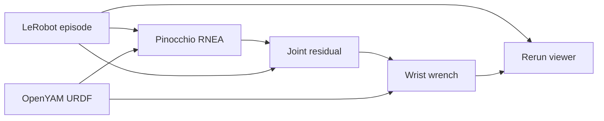

# Kinetic — OpenYAM wrist-force visualization

Kinetic pipeline for checking recorded OpenYAM joint efforts against the robot model. It loads one LeRobot episode, subtracts gravity with Pinocchio, maps the leftover torque to a wrist wrench, and plays that wrench on the same Rerun timeline as the cameras and the joint plots from `lerobot-dataset-viz`.

The default dataset is the car-door collection at `/home/fuheng/test_data/car-door-opening-20260910`. The arm model is the OpenYAM URDF at `/home/fuheng/anvil-loader/config/robot_description.urdf`.

## Pipeline



1. Load one episode. `observation.state` is 21-D: position, velocity, and effort for `right_finger_joint1` and `right_joint1` through `right_joint6`. The finger is left at zero in the model. Only the right arm is used.
2. Put `right_joint1` through `right_joint6` into the Pinocchio configuration. The URDF has no friction or damping. `rnea` returns rigid-body torque only: inertia, Coriolis, and gravity.
3. Gravity torque is `rnea(q, 0, 0)`. A second residual uses recorded joint velocity and finite-difference acceleration so fast motion can be told apart from contact. On the door episodes those two residuals differ by about 0.01 N·m.
4. The recorded effort is flipped once per episode if it anti-correlates with gravity, then the model torque is subtracted. The sign is printed.
5. The residual is mapped to a 6-D wrench at `follower_r_link_6` with Pinocchio `LOCAL_WORLD_ALIGNED`. The origin is the wrist link. The axes stay aligned with the world, so `fz` is vertical and `fx`/`fy` stay in the base horizontal plane as the wrist rotates. Force is in newtons at the wrist origin. Moment is in newton-meters about that same point.
6. Cameras, action, and state are logged with the dataset visualizer. Gravity, residual, and wrench series are added on the same `timestamp` and `frame_index`.

`tau = J(q)^T F` is the same map a controller would use in reverse: a desired world-frame force becomes joint torque through that robot's Jacobian and gravity model.

## Run

Pinocchio is the `pin` package (`import pinocchio`). It is installed in the `lerobot312` environment used for this pipeline.

```bash
/home/fuheng/miniconda3/envs/lerobot312/bin/python examples/openyam/analyze_efforts.py \
  --root /home/fuheng/test_data/car-door-opening-20260910 \
  --urdf /home/fuheng/anvil-loader/config/robot_description.urdf \
  --episode-index 0
```

Then open http://127.0.0.1:9090 and select the recording `car-door-opening-20260910/episode_<index>/wrist`. `--mode distant` serves a gRPC proxy instead of opening the browser. `--web-port` and `--grpc-port` override 9090 and 9876.

The row under the cameras is `wrench/force`, `wrench/torque`, and `wrench/force_dynamics`. Below that are measured effort against gravity torque, both residuals, and the usual position, velocity, and effort plots.

## Reading the wrench

World X points toward the side of the car. A door pull is negative `fx`. On episodes 0 and 3 those spikes are about 50–75 N, next to a spring reading of 14 lb (62 N).

`tz` is the moment about a vertical axis through the wrist, not the moment about the door hinge. During a pull the gripper is only a few centimeters off the wrist, so the wrist moment stays near 1 N·m while `fx` spikes. The hinge is a different vertical axis, farther from the handle, and that lever arm is what swings the door.

Outside the pulls (`|fx|` below 40 N, about 88% of an episode) the estimate does not sit at zero. Median `|fx|` is about 8 N and median `|F|` is about 14 N, mostly a steady upward `fz`. That floor is gravity-model error and friction left inside `J^T F`. Pinocchio does not remove it. A wrist force-torque sensor is what measures the wrench without passing the arm's shoulder friction and gravity through the Jacobian.
